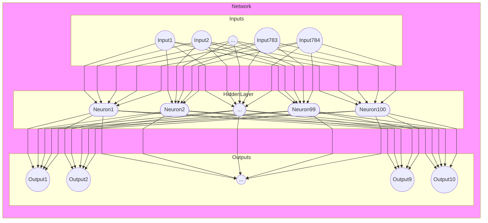

# Fashion MNIST

* https://github.com/zalandoresearch/fashion-mnist

We are training our model with a bunch of closing pictures, to be able to categorize fashion items by their 28x28 pixel image.

## Network

We will create a Neural Network with 784 Inputs (28x28 Pixels), one hidden Layer with 100 Neurons (sigmoid) and 10 outputs (one for each category).

(Chart is not optimal visiulized)

## Dependencies

Install the dependencies by running 00_install_dependencies

## Load training data

### Labels
Each training and test example is assigned to one of the following labels:

| Label | Description |
| --- | --- |
| 0 | T-shirt/top |
| 1 | Trouser |
| 2 | Pullover |
| 3 | Dress |
| 4 | Coat |
| 5 | Sandal |
| 6 | Shirt |
| 7 | Sneaker |
| 8 | Bag |
| 9 | Ankle boot |
