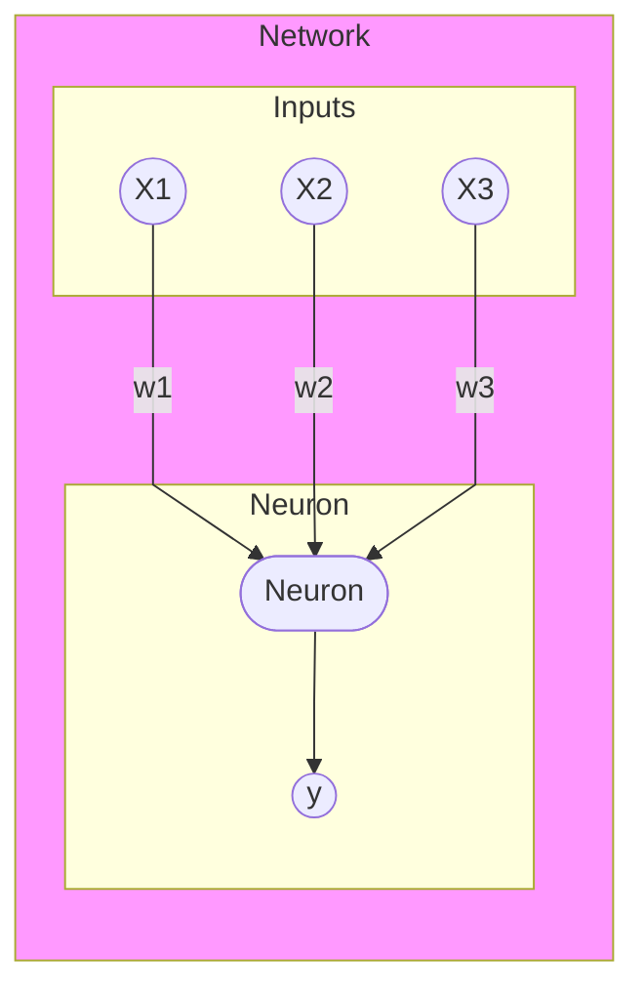
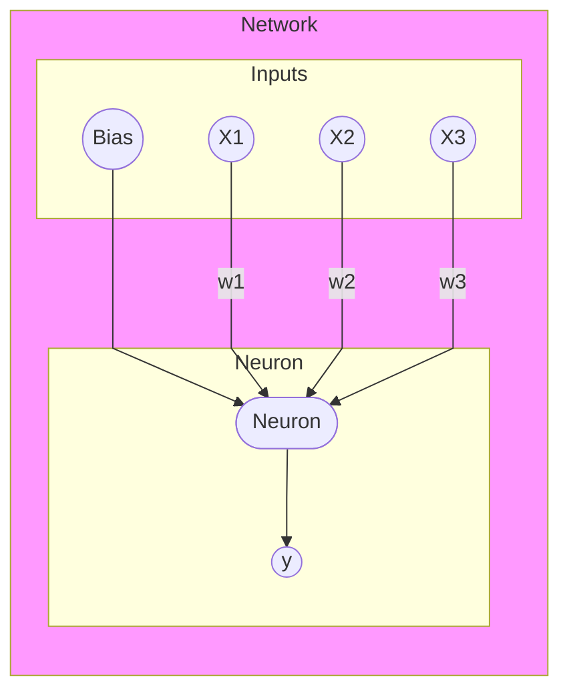
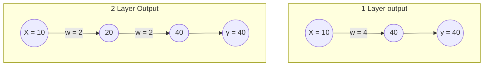

# General explanation of a neuron

## Simple Neuron

A neuron defines a variable number of input values, that are weighted, and generates an output onto them.

The weight has influence on how much an input is influencing the output.

A simple calculation is the sum-up of (x1 * w1 + x2 * w2 + x3 * w3), but in general a [sigmoid or ReLU](https://wandb.ai/ayush-thakur/dl-question-bank/reports/ReLU-vs-Sigmoid-Function-in-Deep-Neural-Networks--VmlldzoyMDk0MzI) function is used, to unify the input to a value between 0 and 1.

y = Sigmoid(x1 * w1 + x2 * w2 + x3 * w3)

A linear regression, that is wrapped into a sigmoid function, to normalize the output value between 0 and 1, is called a logistic regression.
 


([better visualize with other tools](https://github.com/ashishpatel26/Tools-to-Design-or-Visualize-Architecture-of-Neural-Network))

## Neuron with Bias

Bias is a static value, that is added to the input. In a mathematical function like f(x) = x + 2, the Bias reflects the number 2.

```mermaid
xychart-beta
    title "f(x) = x + 2"
    x-axis " X" [0, 1, 2, 3, 4, 5, 6, 7, 8, 9]
    y-axis "Y" 0 --> 9
    line [2, 3, 4, 5, 6, 7]
```

Have a look at the second case "Adding bias" in the 01_linear_regression



The logistic regression of that neutron is mathematically equivalent to y = Sigmoid(x1 * w1 + x2 * w2 + x3 * w3 + bias)

### Linear regression vs Logistic Regression

As explained, a logistic regression equals the linear regression in terms of its inputs, but the output is normalized via a sigmoid (or ReLU) function.

In neural networks, where neuron outputs are used as inputs for the next layer neurons, the usage of an activation function (e.g. sigmoid or ReLU) is mandattory, as otherwise there would be no impact, if the weights of the first and second layer would simply be added to each other and the second layer would be .


