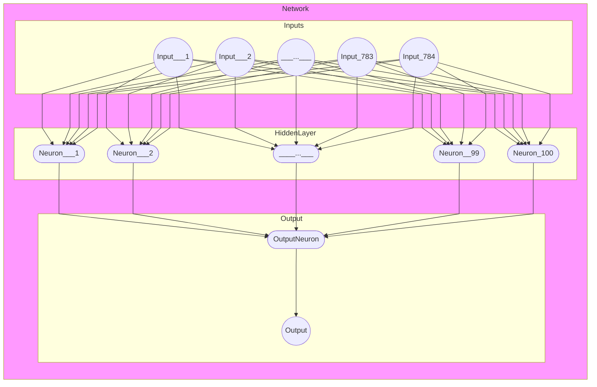

# Fashion MNIST single output

* https://github.com/zalandoresearch/fashion-mnist

We are training our model with a bunch of closing pictures, to be able to categorize fashion items by their 28x28 pixel image.

Each training and test example is assigned to one of the following labels:

| Label | Description |
| --- | --- |
| 0 | T-shirt/top |
| 1 | Trouser |
| 2 | Pullover |
| 3 | Dress |
| 4 | Coat |
| 5 | Sandal |
| 6 | Shirt |
| 7 | Sneaker |
| 8 | Bag |
| 9 | Ankle boot |

## Dependencies

Install the dependencies by running 00_install_dependencies

## Load training data

Load the training by running 01_load_training_data

## Network

### T-Shirt or not T-Shirt

We will create a first Neural Network with 784 Inputs (28x28 Pixels), one hidden Layer with 100 Neurons (sigmoid) and 1 output Neuron. The network will be simplified to only learn if an image is a t-shirt or not.

([better visualize with other tools](https://github.com/ashishpatel26/Tools-to-Design-or-Visualize-Architecture-of-Neural-Network))

### Run the network

Run the neural network by running 02_neural_network
